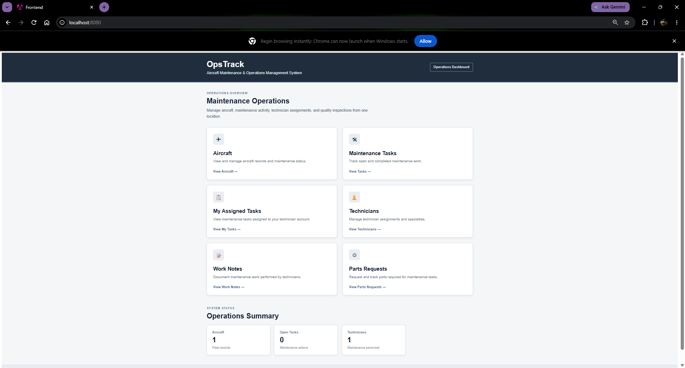
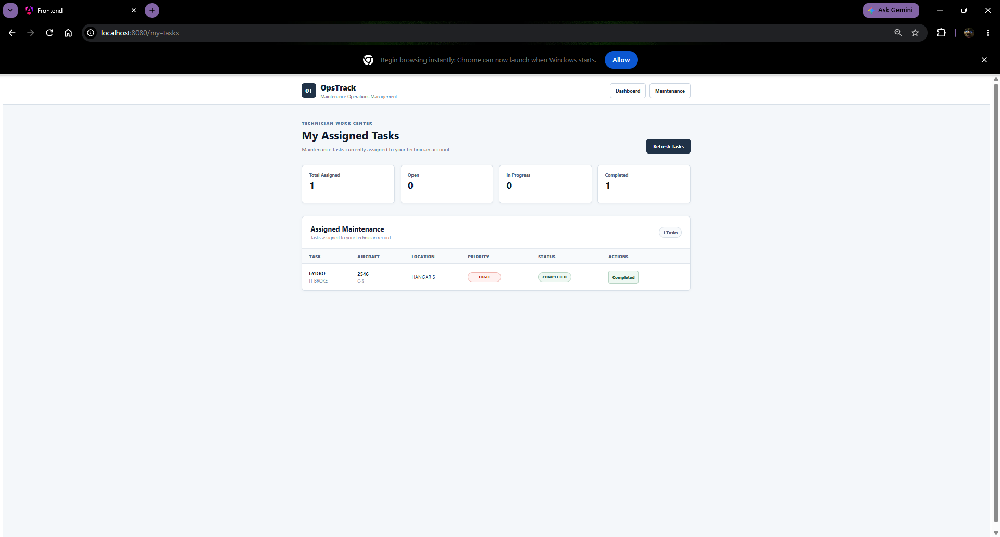
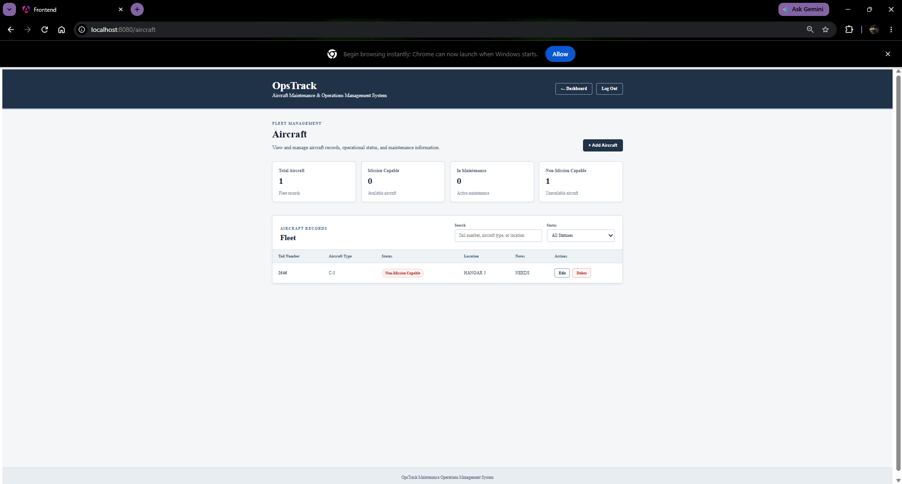
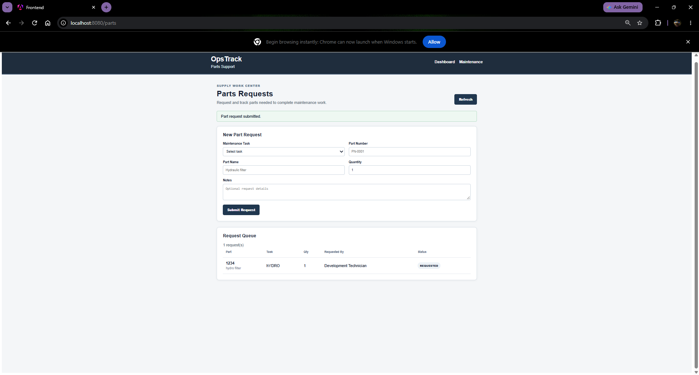
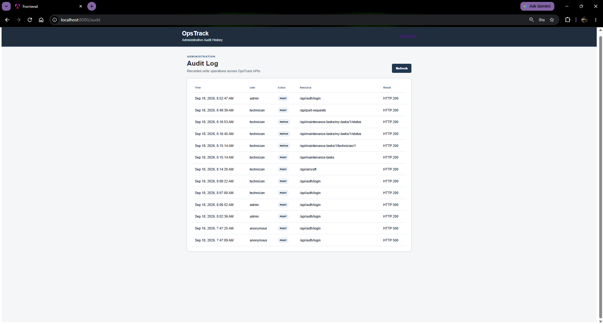

# OpsTrack

OpsTrack is a full-stack aircraft maintenance operations management platform built as an original portfolio project. It models real-world maintenance workflows including aircraft status tracking, maintenance task assignment, technician work, QA inspections, work notes, parts requests, role-based access control, and audit history.

The project was inspired by aircraft maintenance operations and demonstrates the design of a secure, database-backed enterprise application using Java, Spring Boot, Angular, PostgreSQL, and Docker.

## Technology

### Backend

- Java 21
- Spring Boot 4
- Spring Web MVC
- Spring Data JPA
- Spring Security
- Bean Validation
- Maven

### Frontend

- Angular 22
- TypeScript
- HTML/CSS

### Database & Infrastructure

- PostgreSQL
- Docker
- Docker Compose
- Nginx

### Testing

- JUnit
- Mockito
- Spring Security Test
- Angular/Vitest
- Maven test suite

## Roles

OpsTrack uses role-based authorization to separate operational responsibilities.

- `TECHNICIAN` — assigned-task workflow, work notes, and parts requests
- `SUPERVISOR` — maintenance oversight, technician operations, and parts status management
- `QA_INSPECTOR` — QA inspection workflow
- `ADMIN` — broad operational access including audit history

Backend authorization rules enforce access independently of the Angular interface.

## Major Features

- Aircraft records and mission/maintenance status tracking
- Maintenance task creation, priority, status, aircraft association, and technician assignment
- Authenticated **My Assigned Tasks** technician work center
- Server-side task ownership verification
- Technician records linked to application user accounts
- Maintenance workflow from `OPEN` → `IN_PROGRESS` → `COMPLETED`
- QA inspection records and approval status
- Authenticated technician work notes
- Parts request creation and lifecycle management:
  - `REQUESTED`
  - `ORDERED`
  - `RECEIVED`
  - `CANCELLED`
- Session-based authentication with BCrypt password hashing
- Role-based backend and frontend authorization
- Centralized REST exception handling and validation responses
- Audit logging for API write operations
- Angular operations dashboard with role-specific navigation
- PostgreSQL relational persistence
- Dockerized PostgreSQL, Spring Boot, and Angular/Nginx environment

## Application Screenshots

### Operations Dashboard

The operations dashboard provides a centralized view of aircraft maintenance activity and quick access to major OpsTrack functions.



### Technician Work Center

Technicians can view their assigned maintenance tasks and progress authorized work through the maintenance workflow.



### Aircraft Management

Aircraft records provide operational status, location, and maintenance information used throughout the application.



### Parts Requests

Technicians can submit parts requests while authorized users can track requests through their lifecycle.



### Administrative Audit Log

Administrative audit history provides traceability for API write operations, including the user, action, resource, result, and timestamp.



## Architecture

OpsTrack follows a layered backend architecture:

```text
Angular Frontend
       |
       | HTTP / REST
       v
Spring REST Controllers
       |
       v
Service Layer
       |
       v
Spring Data JPA Repositories
       |
       v
PostgreSQL
```

Spring Security sits between the client and protected API endpoints to provide authentication and role-based authorization.

## Project Structure

```text
OpsTrack/
├── backend/
│   └── src/main/java/com/opstrack/
│       ├── aircraft/
│       ├── audit/
│       ├── exception/
│       ├── inspection/
│       ├── maintenance/
│       ├── parts/
│       ├── security/
│       ├── technician/
│       └── worknote/
│
├── frontend/
│   └── src/app/
│       ├── aircraft/
│       ├── audit/
│       ├── auth/
│       ├── dashboard/
│       ├── inspection/
│       ├── maintenance/
│       ├── my-tasks/
│       ├── parts/
│       ├── technician/
│       └── worknote/
│
├── docs/
│   └── screenshots/
│       ├── aircraft.png
│       ├── audit.png
│       ├── dashboard.png
│       ├── my-tasks.png
│       └── parts.png
│
├── Dockerfile
├── docker-compose.yml
└── README.md
```

## Authentication & Authorization

OpsTrack uses server-managed session authentication.

Users authenticate through the Angular login interface. After successful authentication, Spring Security creates an authenticated server session and the browser receives a session cookie.

Protected API requests use that session rather than storing or repeatedly transmitting the user's password.

Passwords are stored as BCrypt hashes.

Authorization is enforced by the Spring Boot backend based on the authenticated user's role. The Angular frontend also uses route guards and role-specific navigation to provide the appropriate interface for each user.

For technician-specific operations, the backend determines the technician from the authenticated application user instead of trusting a technician ID supplied by the browser.

This prevents a technician from changing the client-side technician ID to access another technician's assigned tasks.

## Local Development

### PostgreSQL

Create a PostgreSQL database named:

```text
opstrack
```

Provide database credentials through environment variables:

```powershell
$env:DB_USERNAME="your_postgres_username"
$env:DB_PASSWORD="your_postgres_password"
```

The backend defaults to:

```text
jdbc:postgresql://localhost:5432/opstrack
```

The connection can be overridden with the `DB_URL` environment variable.

### Backend

```powershell
cd backend
.\mvnw.cmd spring-boot:run
```

Backend:

```text
http://localhost:8081
```

### Frontend

```powershell
cd frontend
npm install
npm start
```

Frontend:

```text
http://localhost:4200
```

## Docker

OpsTrack can run as a multi-container environment consisting of:

```text
Angular / Nginx
      |
Spring Boot API
      |
PostgreSQL
```

Start the complete environment from the repository root:

```powershell
docker compose up --build
```

Docker frontend:

```text
http://localhost:8080
```

Docker backend:

```text
http://localhost:8081
```

Docker Compose provides persistent PostgreSQL storage so application data survives container recreation.

The Docker development environment can also initialize development accounts for the supported OpsTrack roles through environment-provided credentials.

Development credentials should never be used for a production deployment.

## Environment Configuration

The backend supports environment-based configuration including:

- `DB_URL`
- `DB_USERNAME`
- `DB_PASSWORD`
- `PORT`
- `JPA_DDL_AUTO`
- `JPA_SHOW_SQL`
- `CORS_ALLOWED_ORIGINS`

Development account initialization can use environment-provided credentials for supported development users.

Real credentials and secrets should never be committed to source control.

For a production environment, database schema changes should be managed explicitly rather than relying on automatic Hibernate schema updates.

## Frontend API Configuration

The Angular API base URL is centralized in:

```text
frontend/src/app/api.config.ts
```

This keeps backend communication configuration separate from individual Angular services and makes the frontend easier to configure for different environments.

## Audit Logging

OpsTrack records write operations performed against application APIs.

Audit records can capture information such as:

- authenticated username
- HTTP operation
- API resource
- resulting HTTP status
- operation timestamp

Audit history provides traceability for changes made through the maintenance system.

## Testing

### Backend

Run the backend automated test suite with:

```powershell
cd backend
.\mvnw.cmd test
```

The backend test suite covers repository, service, controller, security, authentication, ownership, and application workflow behavior.

### Frontend Build Verification

```powershell
cd frontend
npm run build
```

A successful production build verifies that the Angular application compiles for deployment.

## Verified Workflows

The Dockerized OpsTrack environment has been manually verified for several complete workflows:

- PostgreSQL, Spring Boot, and Angular/Nginx containers start successfully
- Development user accounts initialize correctly
- Users can authenticate through the frontend
- Session authentication works through the Dockerized environment
- Aircraft records can be created and persisted
- Maintenance tasks can be created and assigned to technicians
- Assigned tasks appear in the technician work center
- Technicians can move tasks from `OPEN` → `IN_PROGRESS` → `COMPLETED`
- Completed task state persists in PostgreSQL
- Parts requests can be created and persisted
- Audit records are generated for application write operations

## Portfolio Talking Points

OpsTrack demonstrates:

- Full-stack application development
- Java and Spring Boot REST API development
- Angular and TypeScript frontend development
- Relational domain modeling with JPA/Hibernate
- PostgreSQL database integration
- Session-based authentication
- BCrypt password hashing
- Role-based access control
- Server-side resource ownership verification
- REST API integration
- Validation and centralized exception handling
- Automated backend testing
- Git feature-branch and pull-request workflow
- Docker containerization
- Multi-container application configuration
- Persistent database storage
- Audit logging
- Enterprise-style layered architecture

## Project Status

**OpsTrack v1 — Core application complete**

The current version implements the primary aircraft maintenance operations workflow from aircraft and maintenance task management through technician execution, QA-related operations, parts requests, security, persistence, and auditing.